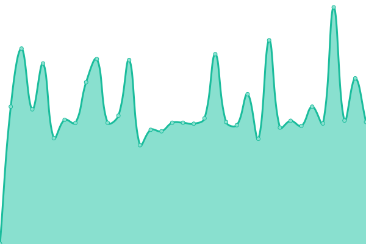

# [📈 Live Status](https://Namide.github.io/upptime): <!--live status--> **🟩 All systems operational**

This repository contains the open-source uptime monitor and status page for [Namide](namide.com), powered by [Upptime](https://github.com/upptime/upptime).

With [Upptime](https://upptime.js.org), you can get your own unlimited and free uptime monitor and status page, powered entirely by a GitHub repository. We use [Issues](https://github.com/Namide/upptime/issues) as incident reports, [Actions](https://github.com/Namide/upptime/actions) as uptime monitors, and [Pages](https://Namide.github.io/upptime) for the status page.

<!--start: status pages-->
<!-- This summary is generated by Upptime (https://github.com/upptime/upptime) -->
<!-- Do not edit this manually, your changes will be overwritten -->
<!-- prettier-ignore -->
| URL | Status | History | Response Time | Uptime |
| --- | ------ | ------- | ------------- | ------ |
|  [Damien](https://damien-doussaud.com/) | 🟩 Up | [damien.yml](https://github.com/Namide/upptime/commits/HEAD/history/damien.yml) | 

 762ms
     
 | 

<a href="https://Namide.github.io/upptime/history/damien">100.00%</a>
    

|  [Namide](https://namide.com/en) | 🟩 Up | [namide.yml](https://github.com/Namide/upptime/commits/HEAD/history/namide.yml) | 

 667ms
     
 | 

<a href="https://Namide.github.io/upptime/history/namide">100.00%</a>
    

|  [Diji](https://diji.namide.com/) | 🟩 Up | [diji.yml](https://github.com/Namide/upptime/commits/HEAD/history/diji.yml) | 

 652ms
     
 | 

<a href="https://Namide.github.io/upptime/history/diji">100.00%</a>
    

|  [Diji API](https://api.diji.namide.com/) | 🟩 Up | [diji-api.yml](https://github.com/Namide/upptime/commits/HEAD/history/diji-api.yml) | 

 671ms
     
 | 

<a href="https://Namide.github.io/upptime/history/diji-api">100.00%</a>
    

|  [Inspire](https://inspire.namide.com/) | 🟩 Up | [inspire.yml](https://github.com/Namide/upptime/commits/HEAD/history/inspire.yml) | 

 941ms
     
 | 

<a href="https://Namide.github.io/upptime/history/inspire">100.00%</a>
    

<!--end: status pages-->

[**Visit our status website →**](https://Namide.github.io/upptime)

## 📄 License

- Powered by: [Upptime](https://github.com/upptime/upptime)
- Code: [MIT](./LICENSE) © [Namide](namide.com)
- Data in the `./history` directory: [Open Database License](https://opendatacommons.org/licenses/odbl/1-0/)
