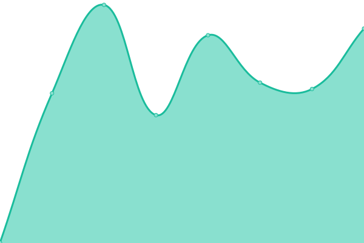

# [📈 Live Status](https://Namide.github.io/upptime): <!--live status--> **🟩 All systems operational**

This repository contains the open-source uptime monitor and status page for [Namide](namide.com), powered by [Upptime](https://github.com/upptime/upptime).

With [Upptime](https://upptime.js.org), you can get your own unlimited and free uptime monitor and status page, powered entirely by a GitHub repository. We use [Issues](https://github.com/Namide/upptime/issues) as incident reports, [Actions](https://github.com/Namide/upptime/actions) as uptime monitors, and [Pages](https://Namide.github.io/upptime) for the status page.

<!--start: status pages-->
<!-- This summary is generated by Upptime (https://github.com/upptime/upptime) -->
<!-- Do not edit this manually, your changes will be overwritten -->
<!-- prettier-ignore -->
| URL | Status | History | Response Time | Uptime |
| --- | ------ | ------- | ------------- | ------ |
|  [Damien](https://damien-doussaud.com/) | 🟩 Up | [damien.yml](https://github.com/Namide/upptime/commits/HEAD/history/damien.yml) | 

 727ms
     
 | 

<a href="https://Namide.github.io/upptime/history/damien">99.53%</a>
    

|  [Namide](https://namide.com/en) | 🟩 Up | [namide.yml](https://github.com/Namide/upptime/commits/HEAD/history/namide.yml) | 

 653ms
     
 | 

<a href="https://Namide.github.io/upptime/history/namide">92.61%</a>
    

|  [Sport frontend](https://sport.namide.com/) | 🟩 Up | [sport-frontend.yml](https://github.com/Namide/upptime/commits/HEAD/history/sport-frontend.yml) | 

 624ms
     
 | 

<a href="https://Namide.github.io/upptime/history/sport-frontend">99.53%</a>
    

|  [Sport API](https://api.sport.namide.com/api/v1) | 🟩 Up | [sport-api.yml](https://github.com/Namide/upptime/commits/HEAD/history/sport-api.yml) | 

 883ms
     
 | 

<a href="https://Namide.github.io/upptime/history/sport-api">99.53%</a>
    

<!--end: status pages-->

[**Visit our status website →**](https://Namide.github.io/upptime)

## 📄 License

- Powered by: [Upptime](https://github.com/upptime/upptime)
- Code: [MIT](./LICENSE) © [Namide](namide.com)
- Data in the `./history` directory: [Open Database License](https://opendatacommons.org/licenses/odbl/1-0/)
